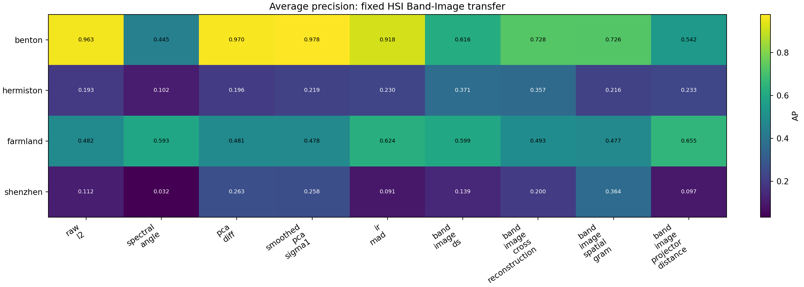
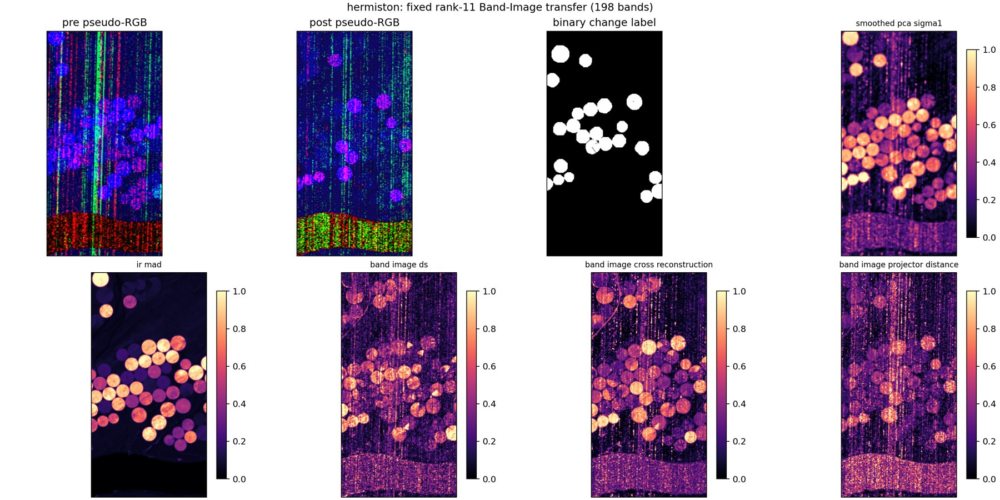
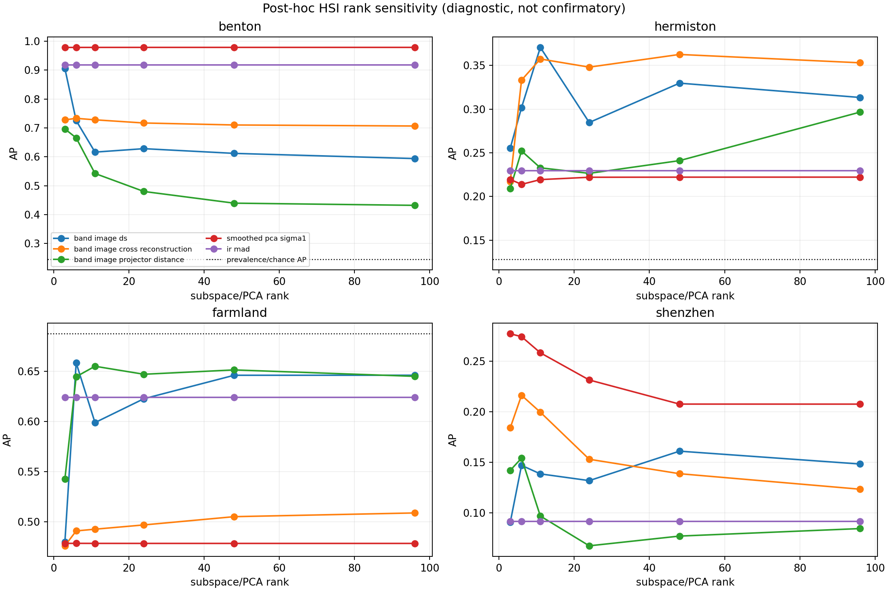

# HSI Band-Image Transfer Pressure Test

## 1. Question

Does the spatial-axis Band-Image construction that produced candidate-
localization evidence on OSCD and xBD-S12 transfer, without label tuning, to
real bitemporal hyperspectral change benchmarks?

This is a cross-sensor pressure test. It is not a disaster benchmark and the
HSI labels were used in earlier, different project experiments. The protocol
was nevertheless fixed before this method was scored.

## 2. Construction

For each date, every retained band image is flattened over the common valid
spatial coordinates:

```text
X_t in R^(N_spatial x B_retained_bands).
```

The primary protocol transfers centered rank `11` unchanged from xBD-S12.
Joint robust band-wise normalization is fitted without labels. Compared maps
are raw L2/CVA, spectral angle, rank-11 PCA-diff, smoothed PCA-diff, IR-MAD,
canonical Band-Image DS, matched cross-reconstruction, normalized spatial
Gram distance, and projector distance. Larger score always means more change;
labels never choose score polarity.

## 3. Fixed Rank-11 Results

Average precision is primary.

| Dataset | Prevalence | Best method | Best AP | DS AP | Cross AP | Projector AP | Smoothed PCA AP | IR-MAD AP |
|---|---:|---|---:|---:|---:|---:|---:|---:|
| Benton | 0.245 | Smoothed PCA | 0.9785 | 0.6162 | 0.7279 | 0.5423 | 0.9785 | 0.9183 |
| Hermiston | 0.128 | **Canonical DS** | **0.3707** | **0.3707** | 0.3574 | 0.2329 | 0.2194 | 0.2298 |
| Farmland | 0.687 | Projector numerically | 0.6550 | 0.5988 | 0.4926 | 0.6550 | 0.4784 | 0.6240 |
| Shenzhen | 0.057 | Spatial Gram | 0.3638 | 0.1386 | 0.1997 | 0.0969 | 0.2584 | 0.0915 |

Farmland must not be called a positive result. Every listed AP is below the
changed-pixel prevalence of `0.687`, and the principal AUROCs are below `0.5`.
This reproduces the scene's known conventional-score polarity problem without
using labels to reverse it.

Macro mean AP is `0.4837` for smoothed PCA, `0.4659` for IR-MAD, `0.4444` for
cross-reconstruction, `0.4311` for canonical DS, and `0.3818` for projector
distance. Macro means mix very different prevalences and are descriptive only.



## 4. Spatial Block-Bootstrap Pressure

The fixed comparisons use 500 resamples of `16 x 16` spatial blocks per
dataset.

| Dataset | Comparison | AP delta | 95% interval |
|---|---|---:|---:|
| Benton | DS - cross | -0.1181 | [-0.2384, +0.0001] |
| Benton | DS - smoothed PCA | -0.3627 | [-0.4399, -0.2942] |
| Hermiston | DS - cross | +0.0115 | [-0.0706, +0.0898] |
| Hermiston | DS - smoothed PCA | **+0.1473** | **[+0.0970, +0.2008]** |
| Farmland | DS - cross | +0.1060 | [+0.0936, +0.1192] |
| Farmland | DS - smoothed PCA | +0.1203 | [+0.1058, +0.1369] |
| Shenzhen | DS - cross | -0.0644 | [-0.1037, -0.0297] |
| Shenzhen | DS - smoothed PCA | -0.1161 | [-0.2388, -0.0240] |

Farmland's positive deltas remain unusable because all conventional rankings
are below chance polarity. Hermiston is the only defensible positive DS scene.
Its DS-vs-smoothed-PCA interval is positive, while DS-vs-cross remains
uncertain.



## 5. Stability And Post-Hoc Rank Diagnostic

Seeds `7`, `1234`, and `2026` produce geometry-map Pearson correlations above
`0.9983` on every scene, so Hermiston is not a randomized-SVD accident.

A post-hoc rank curve used ranks `3,6,11,24,48,96`. It is diagnostic, not
confirmatory:

- Benton DS peaks at rank 3 (`0.9055`) but remains below smoothed PCA (`0.9783`).
- Hermiston DS peaks at rank 11 (`0.3707`); cross-reconstruction is comparably
  strong over ranks 11-96.
- Farmland remains polarity-confounded at every rank.
- Shenzhen geometry remains below PCA/Gram controls.



## 6. Interpretation

The broad transfer hypothesis is rejected. More spectral bands do not make
Band-Image DS generally useful. The Hermiston result supports a narrower
hypothesis: in some scenes where direct amplitude/PCA rankings are weak, a
low-rank spatial change mode can be useful. Four heterogeneous scenes are not
enough to define that regime, and cross-reconstruction explains much of the
same behavior.

Do not proceed to a neural projector-prior trial from this result. A future
HSI study would need additional untouched scenes and a predeclared test of
which unlabeled scene properties predict a DS-favorable regime.

## 7. Reproduction

Primary run:

```powershell
.\.venv\Scripts\python.exe project_cli.py phase1-hsi-band-image-transfer --datasets "benton,hermiston,farmland,shenzhen" --rank 11 --seed 1234 --bootstrap 500 --output-dir phase1/outputs/hsi_band_image_transfer_frozen_complete_20260622_185629
```

Post-hoc rank diagnostic:

```powershell
foreach($rank in 3,6,11,24,48,96){ .\.venv\Scripts\python.exe project_cli.py phase1-hsi-band-image-transfer --datasets "benton,hermiston,farmland,shenzhen" --rank $rank --seed 1234 --bootstrap 0 --output-dir "phase1/outputs/hsi_band_image_rankdiag_r${rank}_20260622_190113" }
```
