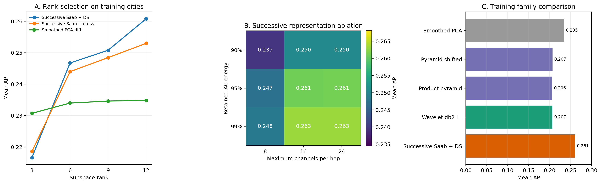
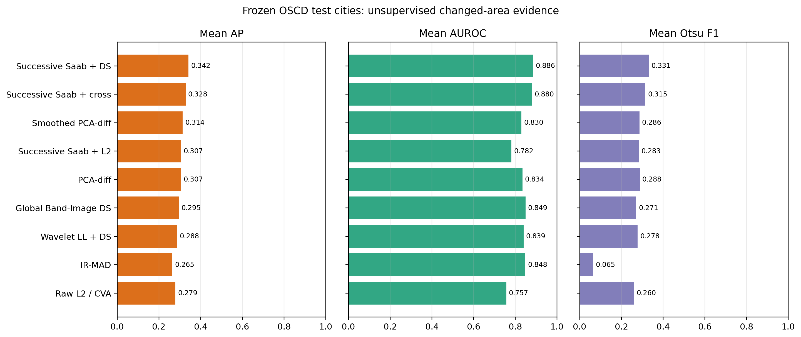
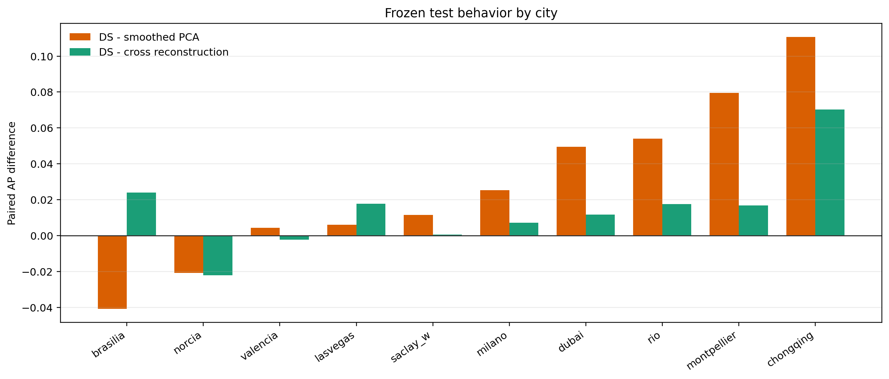

# Successive Spatial Subspace Learning With Difference Subspace On OSCD

## 1. Research Question

Can an unsupervised successive local subspace representation preserve useful
spatial-spectral context for multispectral change detection, and does canonical
Difference Subspace (DS) extract changed-area evidence unavailable from simpler
scores on the same representation?

This experiment responds to Sensei's concern that fitting one global subspace
from unordered pixel spectra breaks spatial information, and to Senpai's
Green-Learning/wavelet suggestion. The result is a scoped satellite adaptation,
not a claim that DS, PixelHop, or wavelets were invented here.

## 2. Evidence Boundary

- Task: unsupervised binary changed-pixel ranking/segmentation on OSCD.
- Development: all 14 official OSCD training cities.
- Held-out evaluation: all 10 official OSCD test cities.
- Test labels were not used to choose rank, retained energy, channel count, or
  wavelet/pyramid settings.
- Primary metrics: city-macro AP and AUROC; Otsu F1 is a label-free threshold
  diagnostic. Best F1 is an oracle diagnostic, not a deployable result.
- The successive transform is pair-adaptive/transductive: it is fitted without
  labels from sampled pre/post neighborhoods of the city being analyzed.
- This is OSCD evidence only. It does not establish disaster-damage,
  cross-dataset, semantic-change, or neural-prior performance.

## 3. Exact Construction

Let the aligned dates be `I_pre, I_post in R^(B x H x W)`, with `B=13`.

### 3.1 Shared successive Saab representation

At hop `h`, extract a `3x3` neighborhood vector

```text
z_t^(h)(p) in R^(9 K_(h-1)),   K_0 = 13.
```

The shared pre/post DC direction is

```text
a_0 = 1 / sqrt(9 K_(h-1)) * 1.
```

Remove the DC projection, estimate an AC covariance from at most 30,000
jointly sampled unlabeled pre/post neighborhoods, and retain leading AC
eigenvectors until 95% AC energy or 15 AC channels are reached. Together with
DC this gives at most 16 responses. The identical transform is applied to both
dates, then `2x2` max pooling precedes the next hop. Two hops are used.

This follows PixelHop's successive neighborhood expansion, Saab DC/AC
subspace approximation, and inter-hop pooling. It omits PixelHop's supervised
LAG/classifier and the adjusted bias because a shared additive channel bias
cancels in paired differences. The safe method name is **successive Saab-DS**,
not full PixelHop.

### 3.2 Spatial Band-Image subspace at each hop

Flatten each of the `K_h` hop response maps into one spatial sample:

```text
X_t^(h) in R^(N_h x K_h).
```

Centered PCA across those response-map samples gives a spatial basis

```text
U_t^(h) in R^(N_h x r_h),
r_h = min(12, K_h - 1).
```

For `U_pre^T U_post = A diag(cos(theta_i)) B^T`, define principal vectors
`u_i = U_pre A_i`, `v_i = U_post B_i`, and canonical DS directions

```text
d_i = (u_i - v_i) / sqrt(2 (1 - cos(theta_i))).
```

Near-identical directions are removed numerically. With `D_h=[d_i]` and
`Delta_h = X_post^(h) - X_pre^(h)`, the hop score is

```text
s_h(p) = || row_p(D_h D_h^T Delta_h) ||_2.
```

Hop maps are resized to the original grid, divided by their unlabeled 99.5th
percentile, clipped to `[0,1]`, and averaged. A secondary product variant
weights hops by their principal-angle geodesic distance; it was predeclared but
did not improve the primary equal fusion.

## 4. Matched Controls

The decisive controls use identical hop features:

- direct row-wise L2 of `Delta_h`;
- PCA-diff on `Delta_h`;
- symmetric excess cross-reconstruction between pre/post spatial bases;
- hop 1 and hop 2 alone;
- three random seeds for neighborhood sampling.

External classical pressure controls are raw L2/CVA, PCA-diff, Gaussian
smoothed PCA-diff, global pixel DS, patch-3 DS, local-window DS, global
Band-Image DS, Celik PCA-k-means, and IR-MAD.

The Senpai-inspired alternatives were also implemented separately:

- whole-image/`2x2`/`4x4` spatial Band-Image DS, fixed and shifted grids;
- product-Grassmann weighting of corresponding local factors;
- Haar/db2 SWT and Haar DWT, with separate LL/LH/HL/HH subspaces;
- matched wavelet L2, PCA, and cross-reconstruction controls.

## 5. Formula And Mechanism Verification

`tests/test_multiresolution_subspaces.py` verifies:

- known principal angles and geodesic/chordal distance;
- equal images produce zero pyramid, SWT/DWT, and successive maps;
- localized synthetic changes score higher inside the changed block;
- shifted grids cover all valid pixels;
- Saab DC/AC kernels are orthonormal.

The canonical DS implementation remains independently covered by
`tests/test_difference_subspace.py`, including canonical/eigen span agreement
and equal-subspace behavior.

## 6. Development Results

### 6.1 Successive rank selection

| rank | successive DS AP | cross AP | smoothed PCA AP |
|---:|---:|---:|---:|
| 3 | 0.2166 | 0.2186 | 0.2307 |
| 6 | 0.2467 | 0.2440 | 0.2340 |
| 9 | 0.2508 | 0.2484 | 0.2346 |
| 12 | **0.2608** | 0.2530 | 0.2348 |

At rank 12, successive DS exceeds:

- matched L2 by `+0.0508` AP, bootstrap 95% CI `[+0.0288,+0.0747]`;
- matched PCA by `+0.0513`, CI `[+0.0296,+0.0752]`;
- matched cross-reconstruction by `+0.0078`, CI `[+0.0034,+0.0127]`;
- smoothed PCA by `+0.0260`, CI `[+0.0095,+0.0434]`.

### 6.2 Representation sensitivity

The 3x3 grid of 90/95/99% retained AC energy and 8/16/24 channel caps shows:

- 8 channels is consistently weaker (`0.2395` to `0.2481` AP);
- 16 and 24 channels are effectively tied;
- 99%/16 nominally reaches `0.2631`, but its paired gain over 95%/16 is only
  `+0.0023`, with CI `[-0.0050,+0.0113]`.

The simpler 95%/16 configuration was therefore frozen.

### 6.3 Pyramid and wavelet gates

The best shifted spatial pyramid obtains AP `0.2070`, below PCA-diff `0.2161`
and smoothed PCA `0.2340`. Against smoothed PCA its paired delta is `-0.0270`,
CI `[-0.0489,-0.0047]`. Product weighting is indistinguishable from equal
fusion.

The best wavelet detector is rank-12 db2 SWT level-2 LL + DS at AP `0.2067`,
below PCA-diff `0.2164` and smoothed PCA `0.2348`. Detail-only AP is `0.1169`;
equal LL/detail fusion is `0.1404`. The high-frequency components therefore
behave mainly as nuisance/misregistration evidence in this protocol.



## 7. Frozen Held-Out Results

| method | AP | AUROC | Otsu F1 | best F1 |
|---|---:|---:|---:|---:|
| Successive Saab + DS | **0.3420** | **0.8861** | **0.3312** | **0.3705** |
| Successive Saab + cross reconstruction | 0.3279 | 0.8802 | 0.3151 | 0.3588 |
| Smoothed PCA-diff | 0.3141 | 0.8295 | 0.2864 | 0.3425 |
| Successive Saab + L2 | 0.3067 | 0.7817 | 0.2835 | 0.3411 |
| PCA-diff | 0.3067 | 0.8339 | 0.2879 | 0.3375 |
| Global Band-Image DS | 0.2951 | 0.8486 | 0.2714 | 0.3365 |
| Wavelet LL + DS | 0.2875 | 0.8393 | 0.2781 | 0.3353 |
| Raw L2 / CVA | 0.2793 | 0.7567 | 0.2601 | 0.3158 |
| IR-MAD | 0.2646 | 0.8477 | 0.0648 | 0.3297 |
| Celik PCA-k-means | 0.2148 | 0.6915 | 0.2599 | 0.2897 |

Paired city evidence for successive DS:

- vs matched L2: `+0.0353` AP, CI `[+0.0133,+0.0653]`, 9/10 wins,
  Wilcoxon `p=0.0039`;
- vs matched PCA: `+0.0370`, CI `[+0.0157,+0.0667]`, 10/10 wins,
  `p=0.0020`;
- vs PCA-diff: `+0.0353`, CI `[+0.0058,+0.0656]`, 9/10 wins,
  `p=0.0273`;
- vs smoothed PCA: `+0.0279`, CI `[+0.0011,+0.0556]`, 8/10 wins,
  `p=0.0840`;
- vs matched cross-reconstruction: `+0.0141`, CI `[+0.0012,+0.0290]`,
  8/10 wins, `p=0.0840`.

Bootstrap intervals support positive macro-AP differences. The Wilcoxon tests
against smoothed PCA and cross-reconstruction do not cross 0.05 with only ten
cities, so those comparisons are promising evidence, not definitive proof.





## 8. Stability And Failure Analysis

Test AP across neighborhood-sampling seeds is:

| seed | AP | AUROC | Otsu F1 |
|---:|---:|---:|---:|
| 7 | 0.3438 | 0.8880 | 0.3339 |
| 1234 | 0.3420 | 0.8861 | 0.3312 |
| 2026 | 0.3405 | 0.8855 | 0.3322 |

The product/geodesic hop weighting reaches AP `0.3411`, so it does not improve
the frozen equal fusion.

Strong gains occur in Chongqing (`+0.1107` AP vs smoothed PCA), Montpellier
(`+0.0794`), Rio (`+0.0540`), and Dubai (`+0.0494`). Failures occur in Brasilia
(`-0.0408`) and Norcia (`-0.0207`). Norcia contains strong agricultural and
seasonal differences; the method still confuses these with labeled structural
change. Equal hop fusion can also suppress a useful single hop in that city.


## 9. Conclusions

Supported by this experiment:

1. Successive unsupervised local subspace features are a substantially better
   spatial support for DS than global pixel spectra, fixed local windows,
   literal grid pyramids, or wavelet coefficient maps on OSCD.
2. DS contributes beyond representation learning alone: it beats L2 and PCA
   on exactly the same hop features on both development and held-out cities.
3. DS also exceeds matched cross-reconstruction on mean test AP, but the
   ten-city nonparametric significance is not yet conclusive.
4. The result is stable to three random feature-fitting seeds.

Not supported:

- that the literal whole-image/`2x2`/`4x4` pyramid is effective;
- that wavelet detail coefficients improve OSCD changed-area detection;
- that the method solves semantic change, disaster damage, or cross-dataset
  generalization;
- that it beats modern supervised neural change detectors;
- that this scoped adaptation is full PixelHop or a complete Green Learning
  system.

## 10. Next Evidence Gates

1. Reproduce the frozen method on a second labeled multispectral dataset.
2. Compare pair-adaptive fitting with a transform fitted only on training
   cities to separate transductive adaptation from general representation.
3. Add a label-free hop-reliability gate designed on training cities, then
   validate once externally; do not tune it on the current test cities.
4. Test seasonal/radiometric robustness explicitly, using Norcia and Brasilia
   as failure cases.
5. Only after external confirmation, test the score as a neural prior against
   a raw-input U-Net/Siamese baseline.

## 11. Reproduction Pointers

- Core implementation:
  `phase1/subspace/successive_subspace_features.py`
- Pyramid implementation:
  `phase1/subspace/multiscale_band_image.py`
- Wavelet implementation:
  `phase1/subspace/wavelet_band_image.py`
- Formula tests:
  `tests/test_multiresolution_subspaces.py`
- Sweep CLI:
  `project_cli.py phase1-spatial-subspace-sweep`
- Curated figure script:
  `phase1/scripts/summarize_multiresolution_subspace_experiment.py`

Primary sources:

- Fukui and Maki, *Difference Subspace and Its Generalization for
  Subspace-Based Methods*, IEEE TPAMI 2015:
  https://ieeexplore.ieee.org/document/7053916
- Kuo et al., *PixelHop: A Successive Subspace Learning Method for Object
  Classification*: https://arxiv.org/abs/1909.08190
- Kuo and Madni, *Green learning: Introduction, examples and outlook*:
  https://doi.org/10.1016/j.jvcir.2022.103685
- Mallat, *A Theory for Multiresolution Signal Decomposition: The Wavelet
  Representation*: https://doi.org/10.1109/34.192463
