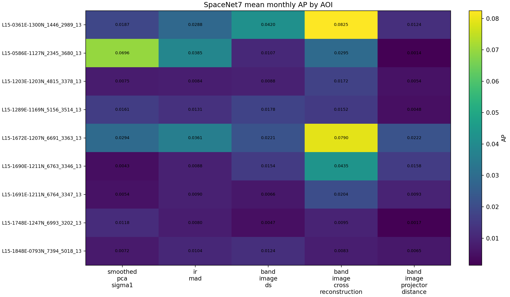
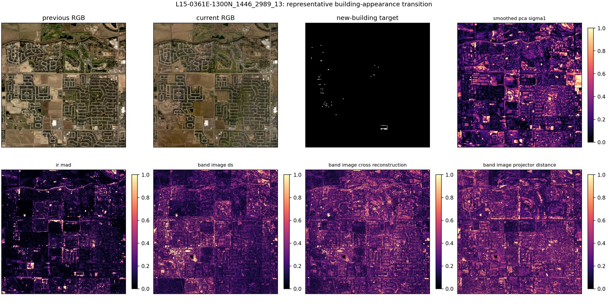

# SpaceNet7 Band-Image Transfer: Building Appearances

## 1. Question

Does the xBD-S12 candidate-localization behavior of spatial Band-Image
subspaces transfer to monthly RGB building appearances?

This is a different construction from the earlier rolling temporal SpaceNet7
experiment. Here each adjacent month is evaluated directly in `128 x 128`
tiles, matching xBD-S12 spatial support. The target is the first appearance of
a persistent building ID. This is not the SpaceNet SCOT metric.

## 2. Frozen Protocol

- Nine AOIs from the local sample, validation, and confirmation sets.
- `197` monthly transitions with at least two retained positive pixels.
- Mean transition prevalence: `0.000868`.
- Three RGB band-image samples per tile; centered rank-two PCA.
- Pair-only alpha/UDM validity.
- No label-fitted rank, threshold, fusion, tile size, or score polarity.
- AOI/transition hierarchical bootstrap with 3,000 repeats.

Methods are raw L2, spectral angle, PCA-diff, smoothed PCA-diff, IR-MAD,
canonical Band-Image DS, cross-reconstruction, spatial Gram, and projector
distance.

## 3. Results

| Method | Mean transition AP | Mean AUROC | Recall at 5% | Enrichment at 5% |
|---|---:|---:|---:|---:|
| Raw L2/CVA | **0.05599** | 0.7721 | 0.4437 | 8.87x |
| Cross-reconstruction | 0.03545 | 0.7782 | 0.3984 | 7.97x |
| Spatial Gram | 0.02761 | 0.7540 | 0.3259 | 6.52x |
| Spectral angle | 0.02264 | 0.6451 | 0.2562 | 5.12x |
| Smoothed PCA | 0.01985 | 0.7937 | 0.3765 | 7.53x |
| IR-MAD | 0.01841 | **0.8190** | **0.4641** | **9.28x** |
| Canonical DS | 0.01575 | 0.7503 | 0.3361 | 6.72x |
| PCA-diff | 0.01464 | 0.7655 | 0.3736 | 7.47x |
| Projector distance | 0.00891 | 0.6736 | 0.2264 | 4.53x |

Raw L2 wins 76 of 197 monthly transitions. Cross-reconstruction wins 35,
IR-MAD 24, projector 12, and canonical DS 10.



## 4. Paired Clustered Comparisons

| Comparison | Mean AP delta | Hierarchical 95% interval |
|---|---:|---:|
| Projector - IR-MAD | **-0.00950** | **[-0.01991, -0.00162]** |
| Projector - smoothed PCA | -0.01094 | [-0.03167, +0.00176] |
| DS - cross-reconstruction | **-0.01970** | **[-0.03811, -0.00668]** |
| DS - smoothed PCA | -0.00410 | [-0.02418, +0.00947] |

The two most important intervals are entirely negative. Projector distance
does not retain its xBD-S12 advantage over IR-MAD, and canonical DS removes
useful information relative to its matched cross-reconstruction control.



## 5. Interpretation And Decision

The generic building-localization transfer hypothesis is rejected for this
RGB construction. The xBD-S12 projector result should be interpreted as a
multispectral/event-task-specific effect, not generic spatial building
localization. With only three band images, centered rank-two geometry is also
a severe information bottleneck.

The predeclared gate for a neural projector-prior experiment is not met.
Running that experiment now would promote a representation that failed its
independent task transfer. Neural work should wait for either:

1. another labeled multispectral event dataset that reproduces the xBD
   candidate result; or
2. a materially new mechanism with its own development and held-out protocol.

Cross-reconstruction is more transferable than canonical DS on SpaceNet7,
but raw L2 remains the strongest AP baseline. This is not a new positive
method claim.

## 6. Reproduction

```powershell
.\.venv\Scripts\python.exe project_cli.py phase1-spacenet7-band-image-transfer --workers 4 --bootstrap 3000 --output-dir phase1/outputs/spacenet7_band_image_transfer_frozen_20260622_191204
```
