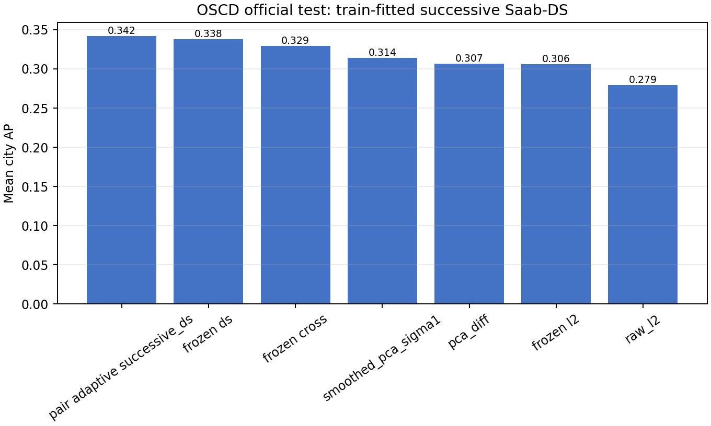
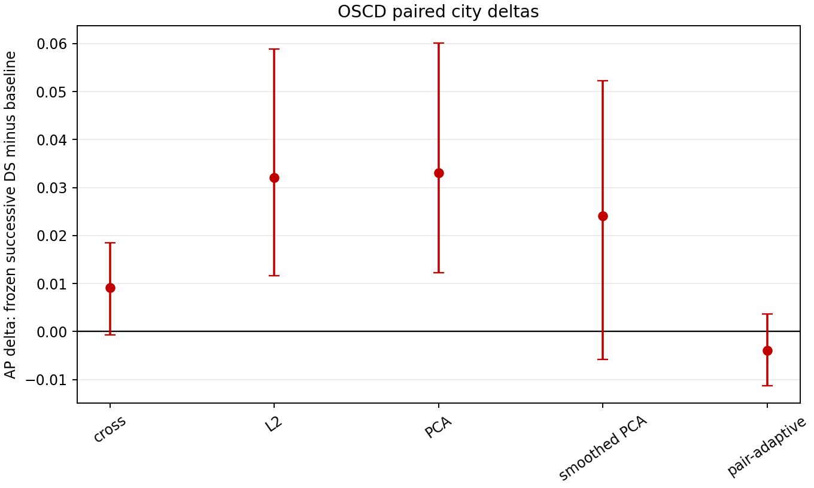
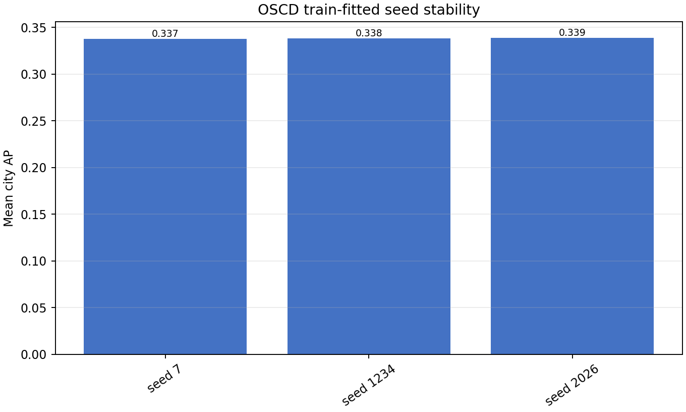
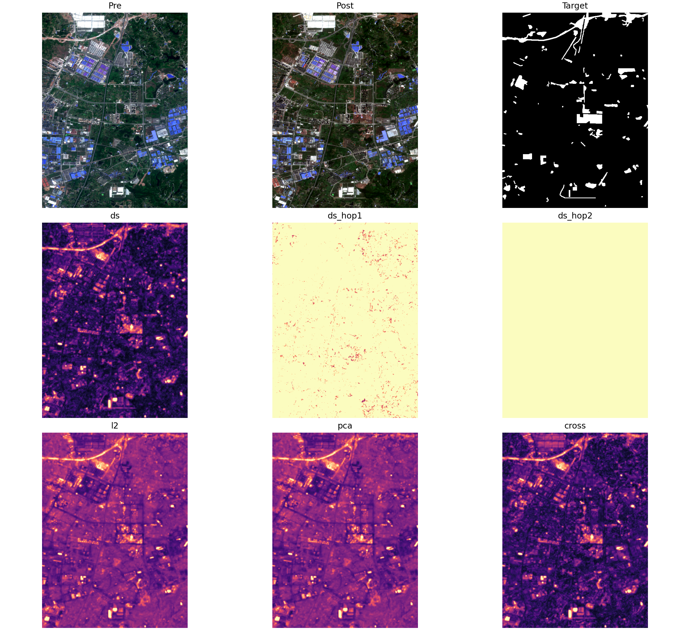
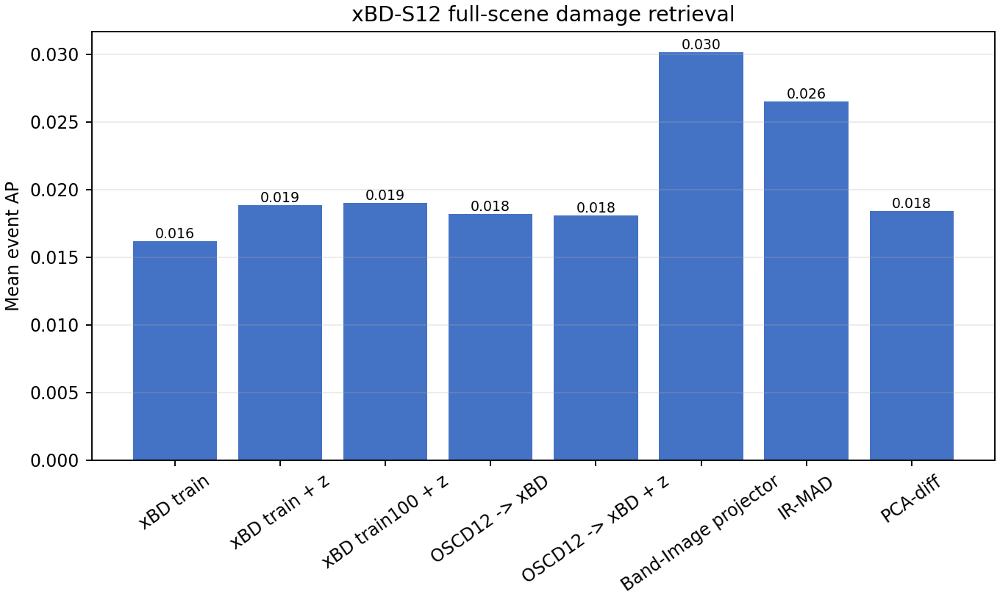
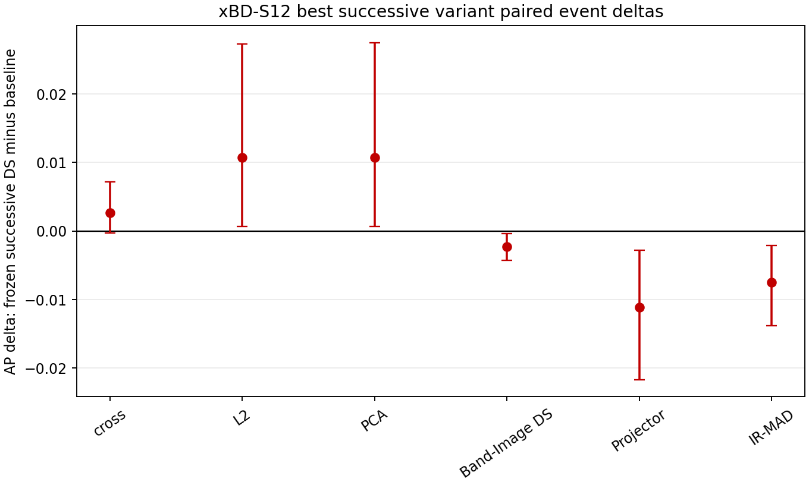
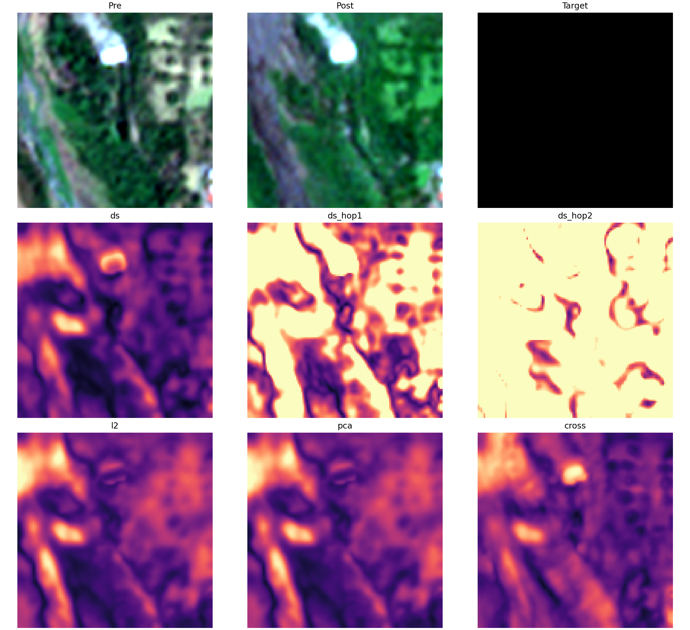
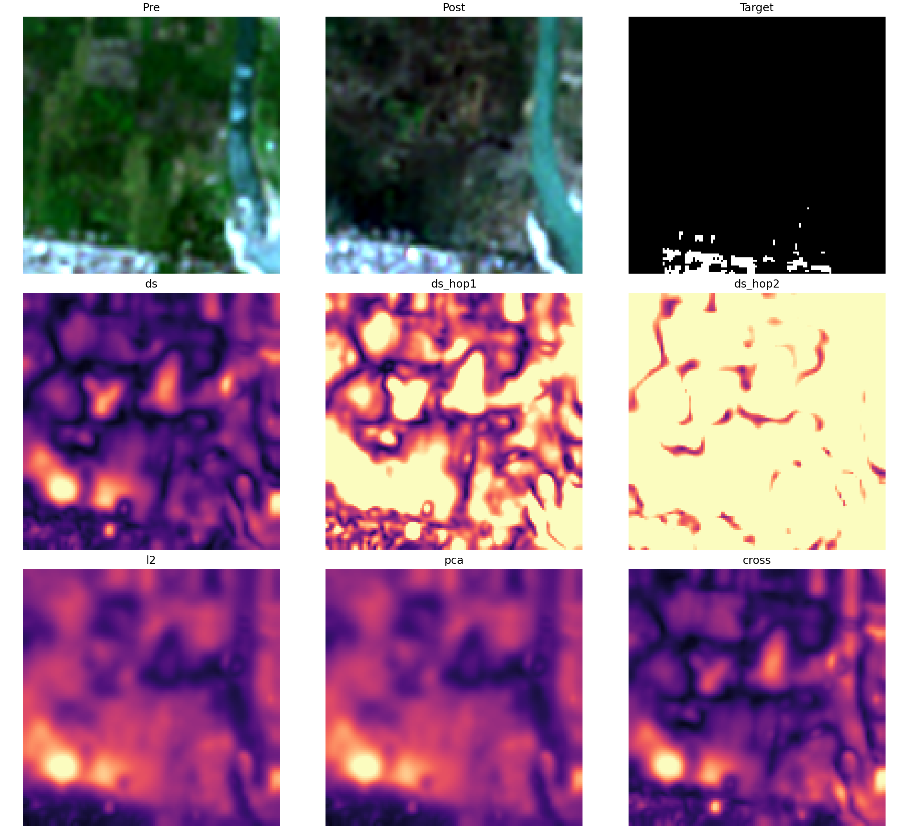

# Train-Fitted Successive Saab-DS And External Transfer Gate

## 1. Question

Does the positive OSCD successive Saab-DS result survive when the local Saab
filters are fitted once on training data and then frozen for held-out scenes?
If yes, does that same representation transfer to xBD-S12 disaster change
evidence?

This gate directly addresses the main weakness of the 2026-06-23 OSCD report:
the earlier successive transform was pair-adaptive/transductive. Here the
successive filters are fitted from training pairs only. Labels are not used for
filter fitting, normalization, rank selection, thresholds, or score fusion.

## 2. Exact Protocol

### 2.1 Frozen successive transform

For a training pair `I_pre, I_post in R^(B x H x W)`, unlabeled `3x3`
neighborhoods are sampled from both dates. At each hop, a shared Saab transform
is fitted from the pooled pre/post training neighborhoods:

```text
DC direction: a_0 = 1 / sqrt(9K) * 1
AC directions: leading PCA eigenvectors after removing the DC projection
retention: 95% AC energy, max 16 channels
pooling: 2x2 max pool between hops
hops: 2
```

The same frozen filters are then applied to every held-out pre/post pair. DS is
still computed per held-out pair in the frozen feature space, because the
research object is the difference between the pair's pre/post spatial feature
subspaces.

### 2.2 Matched controls

The following scores use exactly the same frozen hop feature maps:

- `frozen_successive_ds`: canonical DS projection magnitude;
- `frozen_successive_l2`: direct row-wise L2 in frozen feature space;
- `frozen_successive_pca`: PCA-diff on frozen feature differences;
- `frozen_successive_cross`: symmetric cross-reconstruction between pre/post
  spatial bases;
- hop-1 and hop-2 DS maps separately.

This answers whether DS contributes beyond the learned representation itself.

## 3. OSCD Train-City-Fitted Result

Model fitting source: all 14 official OSCD training cities.  Evaluation:
all 10 official OSCD test cities.  Input: normalized 13-band Sentinel-2.

| Method | Mean city AP | Mean AUROC | Mean Otsu F1 |
|---|---:|---:|---:|
| Pair-adaptive successive DS | 0.3420 | 0.8861 | 0.3312 |
| **Frozen train-fitted successive DS** | **0.3381** | **0.8912** | **0.3315** |
| Frozen cross-reconstruction | 0.3290 | 0.8850 | 0.3176 |
| Smoothed PCA-diff | 0.3141 | 0.8295 | 0.2863 |
| PCA-diff | 0.3067 | 0.8339 | 0.2879 |
| Frozen feature L2 | 0.3061 | 0.7818 | 0.2829 |
| Frozen feature PCA | 0.3051 | 0.7799 | 0.2821 |
| Raw L2 / CVA | 0.2793 | 0.7567 | 0.2601 |

Paired city AP deltas for frozen DS:

| Comparison | AP delta | 95% city bootstrap interval | Wins | Wilcoxon p |
|---|---:|---:|---:|---:|
| DS - frozen L2 | +0.0321 | [+0.0117,+0.0589] | 9/10 | 0.0098 |
| DS - frozen PCA | +0.0330 | [+0.0122,+0.0601] | 9/10 | 0.0059 |
| DS - PCA-diff | +0.0314 | [+0.0008,+0.0614] | 7/10 | 0.1309 |
| DS - smoothed PCA | +0.0240 | [-0.0058,+0.0522] | 7/10 | 0.2324 |
| DS - cross-reconstruction | +0.0091 | [-0.0007,+0.0185] | 7/10 | 0.1602 |
| DS - pair-adaptive DS | -0.0039 | [-0.0113,+0.0037] | 5/10 | 0.3750 |

Interpretation: the pair-adaptive criticism does not explain the OSCD result.
Frozen train-city filters retain almost all AP and slightly improve AUROC. The
strongest supported DS-specific claim is against matched L2/PCA controls. The
cross-reconstruction comparison remains positive in mean AP but not conclusive
with ten cities.





## 4. OSCD Seed Stability

| Seed | Mean city AP | Mean AUROC |
|---:|---:|---:|
| 7 | 0.3375 | 0.8915 |
| 1234 | 0.3381 | 0.8912 |
| 2026 | 0.3389 | 0.8920 |

The train-fitted result is stable to the neighborhood-sampling seed.



Representative map:



## 5. xBD-S12 External Transfer

Evaluation: all 1,577 official held-out xBD-S12 test patches from five usable
test disasters. Statistical unit: disaster event.  Primary view:
full-scene damaged-pixel retrieval, where positives are minor/major/destroyed
pixels and negatives are intact-building/background pixels.

Variants tested:

- xBD-train-fitted filters, native xBD normalization;
- xBD-train-fitted filters, pairwise band z-score normalization;
- xBD-train-fitted filters from 100 patches/event, pairwise band z-score;
- OSCD-common-12-band filters transferred to xBD, native normalization;
- OSCD-common-12-band filters transferred to xBD, pairwise band z-score.

| Variant or baseline | Mean event AP | Mean event AUROC |
|---|---:|---:|
| Band-Image projector distance | **0.03015** | **0.7337** |
| IR-MAD | 0.02649 | 0.7296 |
| Band-Image canonical DS | 0.02124 | 0.6260 |
| Best frozen successive DS: xBD train100 + z-score | 0.01900 | 0.6209 |
| OSCD12 -> xBD native frozen successive DS | 0.01820 | 0.6359 |
| OSCD12 -> xBD z-score frozen successive DS | 0.01809 | 0.6271 |
| PCA-diff | 0.01840 | 0.5907 |
| xBD-train native frozen successive DS | 0.01619 | 0.6118 |
| Raw L2 / CVA | 0.00831 | 0.4426 |

Best successive variant paired event AP deltas:

| Comparison | AP delta | 95% event bootstrap interval | Wins |
|---|---:|---:|---:|
| DS - frozen feature L2 | +0.0107 | [+0.0006,+0.0273] | 4/5 |
| DS - frozen feature PCA | +0.0107 | [+0.0006,+0.0275] | 4/5 |
| DS - frozen cross-reconstruction | +0.0027 | [-0.0003,+0.0072] | 3/5 |
| DS - PCA-diff | +0.0006 | [-0.0013,+0.0024] | 3/5 |
| DS - Band-Image canonical DS | -0.0022 | [-0.0042,-0.0004] | 1/5 |
| DS - IR-MAD | -0.0075 | [-0.0138,-0.0021] | 1/5 |
| DS - Band-Image projector | -0.0112 | [-0.0217,-0.0028] | 1/5 |

Interpretation: frozen successive Saab-DS does not transfer as the best xBD
disaster detector. It remains better than matched frozen-feature L2/PCA, but
it trails the simpler Band-Image projector, IR-MAD, and Band-Image canonical
DS. More xBD training patches and pairwise z-scoring do not close the gap.





Representative xBD maps:





## 6. Decision

Supported now:

1. Successive local Saab features plus DS are a real OSCD spatial-support
   improvement, not merely pair-adaptive overfitting.
2. DS contributes beyond matched L2/PCA in the frozen feature space.
3. The OSCD result is stable to three seeds.
4. xBD-S12 does not support promoting successive Saab-DS as the external
   disaster-damage method.

Not supported:

- claiming external generalization of successive Saab-DS;
- claiming xBD damage detection superiority;
- claiming cross-reconstruction is decisively worse than DS across all tasks;
- treating PixelHop/Green Learning inspiration as enough for novelty.

Current research direction after this gate:

```text
OSCD: successive local subspace features are the strongest internal spatial DS result.
xBD-S12: spatial Band-Image/projector geometry remains the stronger external candidate-localization result.
```

For a paper or seminar, the clean story is therefore not “one method wins
everywhere.” The evidence supports a more honest mechanism claim:

> Local successive subspace features make DS useful for OSCD-style changed-area
> maps, while xBD disaster transfer favors simpler spatial projector geometry.
> The project should now explain when each subspace construction matches the
> task rather than forcing one DS variant across every dataset.

## 7. Reproduction Commands

OSCD official train-fitted gate:

```powershell
.\.venv\Scripts\python.exe project_cli.py phase1-successive-transfer --fit-source oscd13 --target oscd --max-fit-samples 30000 --bootstrap 5000 --maps-per-unit 2 --device cuda --output-dir phase1/outputs/successive_transfer_oscd_trainfit_official_20260623_084003
```

xBD-S12 native train-fitted gate:

```powershell
.\.venv\Scripts\python.exe project_cli.py phase1-successive-transfer --fit-source xbd12 --target xbd --fit-patches-per-event 20 --max-fit-samples 30000 --bootstrap 5000 --maps-per-unit 1 --device cuda --output-dir phase1/outputs/successive_transfer_xbd_trainfit_official_20260623_084114
```

Best xBD successive sensitivity:

```powershell
.\.venv\Scripts\python.exe project_cli.py phase1-successive-transfer --fit-source xbd12 --target xbd --input-normalization pair_band_zscore --fit-patches-per-event 100 --max-fit-samples 30000 --bootstrap 5000 --maps-per-unit 0 --device cuda --output-dir phase1/outputs/successive_transfer_xbd_trainfit_pairz100_20260623_091718
```

Figure summary:

```powershell
.\.venv\Scripts\python.exe phase1\scripts\summarize_successive_transfer_experiment.py --oscd-primary phase1/outputs/successive_transfer_oscd_trainfit_official_20260623_084003 --oscd-seed7 phase1/outputs/successive_transfer_oscd_trainfit_seed7_20260623_091518 --oscd-seed2026 phase1/outputs/successive_transfer_oscd_trainfit_seed2026_20260623_091613 --xbd-trainfit phase1/outputs/successive_transfer_xbd_trainfit_official_20260623_084114 --xbd-oscd-native phase1/outputs/successive_transfer_oscd12_to_xbd_native_20260623_084822 --xbd-oscd-pairz phase1/outputs/successive_transfer_oscd12_to_xbd_pairz_20260623_085743 --xbd-trainfit-pairz phase1/outputs/successive_transfer_xbd_trainfit_pairz_20260623_090651 --xbd-trainfit-pairz100 phase1/outputs/successive_transfer_xbd_trainfit_pairz100_20260623_091718 --output-dir docs/experiment_reports/assets/successive_transfer_2026-06-23
```

## 8. Source Trail

- Successive Saab/PixelHop inspiration: Kuo et al., PixelHop / successive
  subspace learning.
- Canonical DS: Fukui and Maki, TPAMI 2015.
- OSCD split and task: Daudt et al. OSCD Sentinel-2 change detection.
- xBD-S12 split, bands, and normalization: prs-eth/xbd-s12 and Dietrich et al.
- Implementation: `phase1/subspace/successive_subspace_features.py` and
  `phase1/scripts/evaluate_frozen_successive_transfer.py`.
