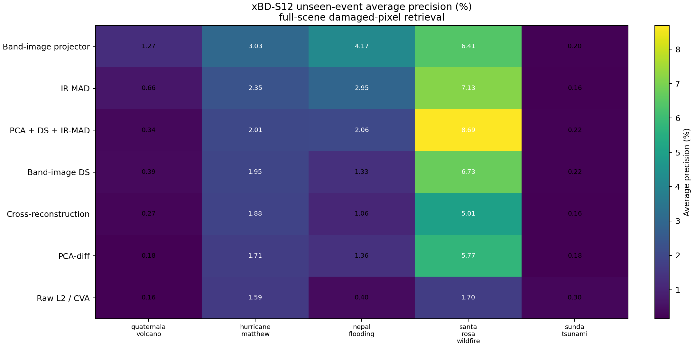
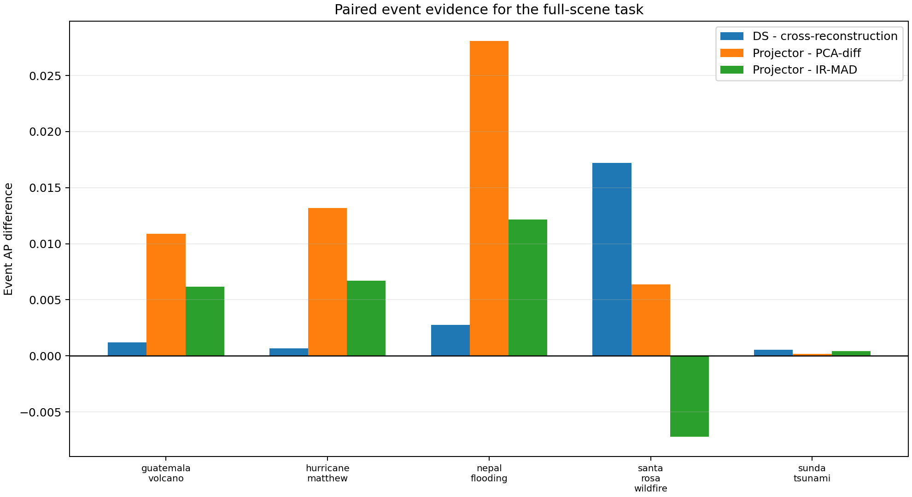
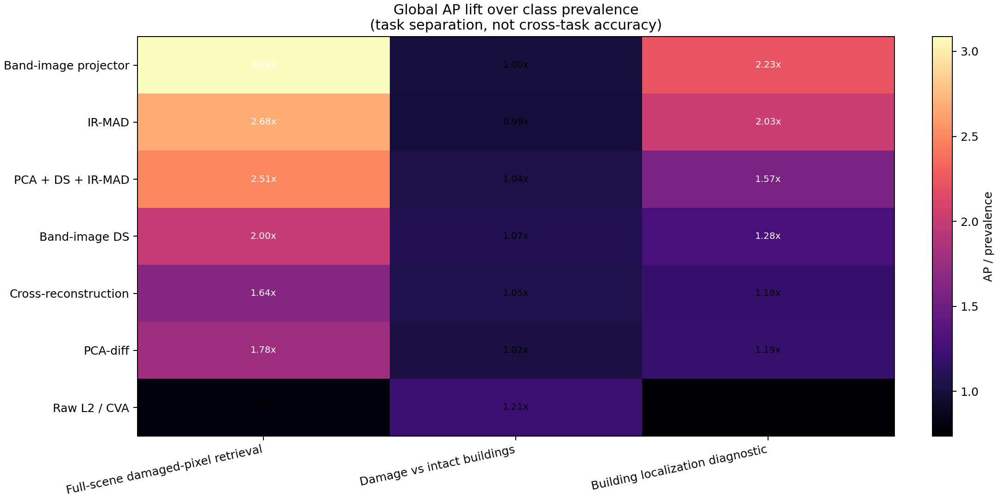
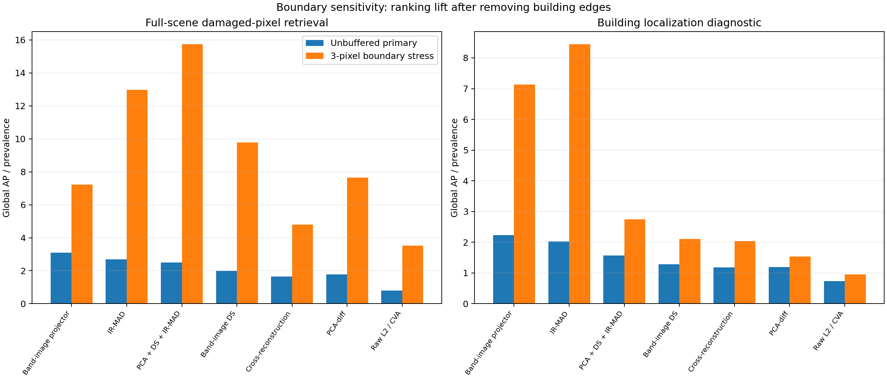
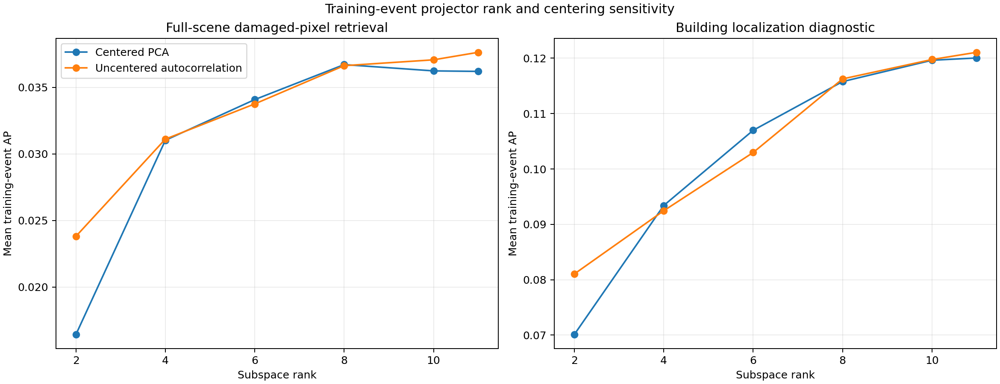
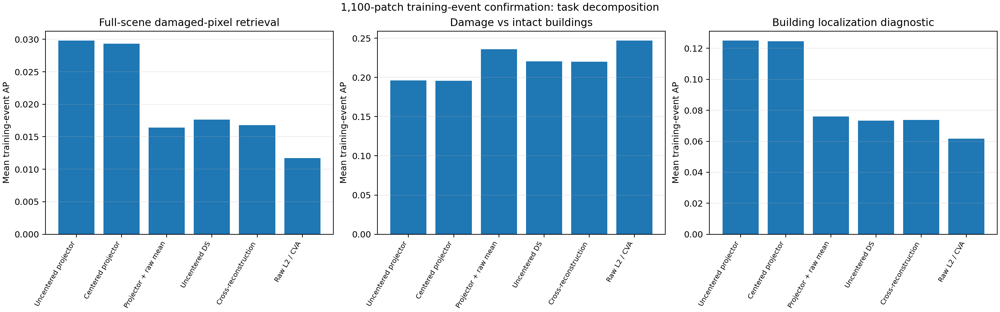
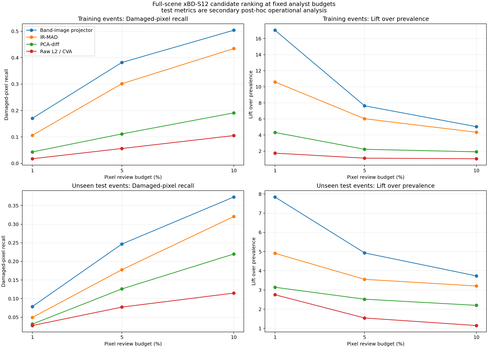
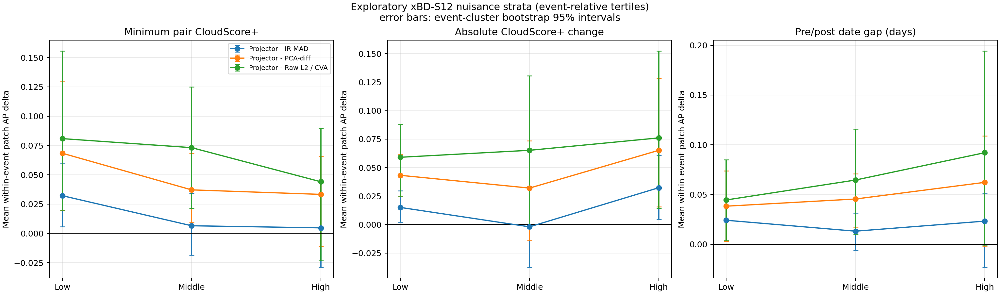
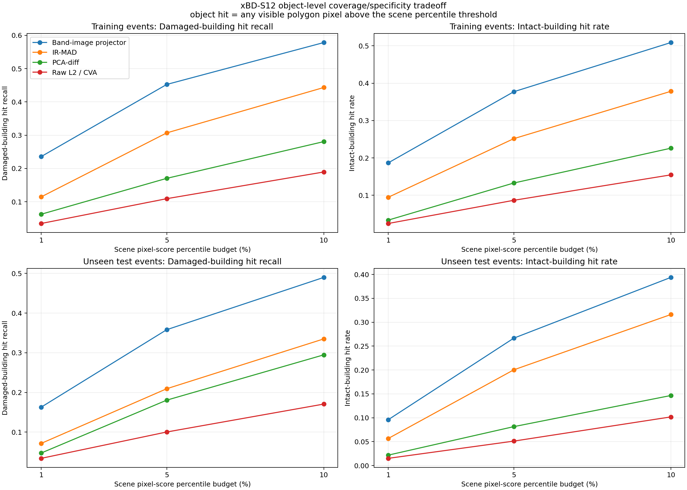
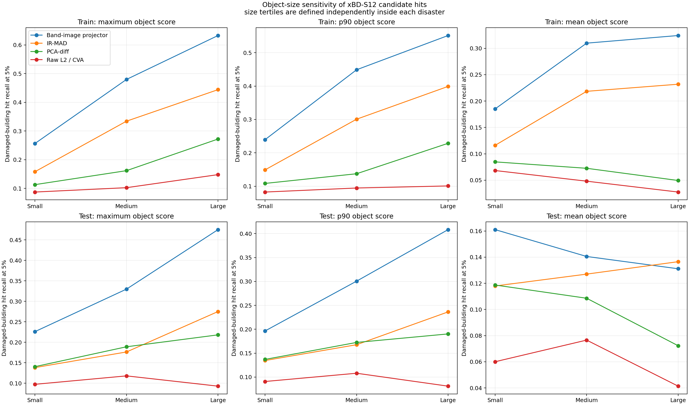

# xBD-S12 External Validation: Spatial Subspace Geometry

## 1. Research Question

Does the Band-Image subspace construction transfer from OSCD to an independent,
event-disjoint multispectral disaster dataset, and what information does it
actually encode: damage, building localization, or generic radiometric change?

The protocol was frozen before inspecting xBD-S12 method outputs. The primary
run evaluates all `1,577` official test-event patches from five unseen
disasters. No xBD-S12 label selected rank, preprocessing, smoothing, fusion
weights, or thresholds.

## 2. Evidence Status

- `[external experiment evidence]` Official xBD-S12 Sentinel-2 release,
  event-disjoint test split, `12 x 128 x 128` pre/post inputs.
- `[external experiment evidence]` `1,577/1,577` patches completed; zero method
  failures.
- `[implementation evidence]` Official 1st/99th-percentile Sentinel-2
  normalization and official categorical mask downsampling are reproduced.
- `[limitation]` Only five independent test events exist. The smallest possible
  two-sided Wilcoxon p-value for a consistent five-event direction is `0.0625`.
- `[limitation]` xBD labels originate at VHR resolution and are downsampled to
  4 m Sentinel-2 patches. This is coarse damaged-pixel evidence, not exact
  building-damage segmentation.

## 3. Construction And Comparisons

For each date, the twelve aligned Sentinel-2 band images are flattened into
twelve spatial samples:

```text
X_t in R^(N_spatial x 12), N_spatial = 128 x 128 valid locations.
```

Centered rank-11 PCA gives a spatial subspace for each date. The tested
geometry maps are:

1. canonical Band-Image Difference Subspace projection magnitude;
2. matched symmetric cross-reconstruction control;
3. row-wise projector distance between the two spatial subspaces;
4. normalized spatial Gram distance.

Baselines are raw L2/CVA, spectral angle, PCA-diff, smoothed/multiscale
PCA-diff, and IR-MAD. Equal-weight fusions use within-patch percentile ranks.

## 4. Primary Full-Scene Damage Retrieval

Positives are minor/major/destroyed pixels; intact buildings and background
are negatives. Average precision (AP) is primary because global prevalence is
only `0.01191`.

| Method | Mean event AUROC | Mean event AP | Global AP | Global best F1 |
|---|---:|---:|---:|---:|
| Band-image projector distance | **0.7337** | **0.03015** | **0.03675** | **0.0877** |
| IR-MAD | 0.7296 | 0.02649 | 0.03194 | 0.0725 |
| PCA + DS + IR-MAD rank fusion | 0.6831 | 0.02664 | 0.02985 | 0.0713 |
| Band-Image canonical DS | 0.6260 | 0.02124 | 0.02377 | 0.0600 |
| PCA-diff | 0.5907 | 0.01840 | 0.02123 | 0.0515 |
| Matched cross-reconstruction | 0.6153 | 0.01676 | 0.01955 | 0.0453 |
| Raw L2 / CVA | 0.4426 | 0.00831 | 0.00937 | 0.0235 |

Projector distance beats PCA-diff in all five events. Its exploratory mean
event AP delta is `+0.01175`, with event-cluster bootstrap 95% interval
`[+0.00445,+0.02032]`. It beats IR-MAD in four of five events, but that
interval crosses zero (`+0.00366`, `[-0.00186,+0.00879]`).



## 5. DS-Specific Matched-Control Result

Canonical DS is not the best individual method, but it contributes information
that the rank- and input-matched cross-reconstruction substitute does not:

| Comparison | Mean event AP delta | 95% event-bootstrap interval | Event wins | Wilcoxon p |
|---|---:|---:|---:|---:|
| DS - cross-reconstruction, unbuffered | +0.00448 | [+0.00074,+0.01099] | 5/5 | 0.0625 |
| DS-fusion - cross-fusion, unbuffered | +0.00173 | [+0.00014,+0.00413] | 5/5 | 0.0625 |
| DS - cross-reconstruction, 3-pixel stress | +0.00121 | [+0.00005,+0.00285] | 5/5 | 0.0625 |

This is consistent directional evidence on the five official test events. A
later training-event pressure test (Section 9) shows that the DS-minus-control
direction is not universal across disasters, so it must not be generalized as
a dataset-wide DS advantage.



## 6. What The Geometry Represents

Three label views separate the task:

| View | Global prevalence | Best method | Global AP | Interpretation |
|---|---:|---|---:|---|
| Full-scene damaged-pixel retrieval | 0.01191 | Projector distance | 0.03675 | Candidate ranking in the whole scene |
| Damage vs intact buildings | 0.33071 | Raw L2 | 0.39876 | Damage discrimination once building support is known |
| Building localization diagnostic | 0.03600 | Projector distance | 0.08039 | Building-related spatial structure |

Projector distance is strongest for building localization and full-scene
retrieval, but it is not strong for damage-versus-intact discrimination. Raw
L2 shows the reverse pattern. Therefore the projector's full-scene lead is
partly a localization effect. The correct interpretation is a possible
**candidate-localization prior**, not a direct damage-severity score.



## 7. Boundary Stress Test

A separate sensitivity run removes both sides of all building boundaries
within three 4 m pixels. This is deliberately severe: it leaves only `3,119`
damaged pixels and `17,176` building-interior pixels across the complete test
set, versus `307,228` and `928,993` unbuffered.

The stress run therefore cannot replace the primary view. It answers whether
results vanish when edges and possible alignment artifacts are excluded.

- Canonical DS still beats cross-reconstruction in all five events.
- The PCA + DS + IR-MAD fusion has the best mean event AP (`0.00319`) for
  full-scene retrieval; IR-MAD is second (`0.00293`).
- Projector distance keeps high mean event AUROC (`0.8174`) but loses the AP
  lead, consistent with its strong boundary/localization sensitivity.
- AP/prevalence lift remains above chance for the principal geometry and
  IR-MAD methods, but absolute AP is unstable because prevalence falls to
  `0.000139`.



## 8. Defensible Finding

The current defensible finding is:

> A spatial band-image subspace representation transfers across OSCD and
> xBD-S12 as label-free changed-structure evidence. Projector geometry is most
> useful for candidate localization. Canonical DS contributes beyond matched
> cross-reconstruction on the five test events, but that direction is not
> stable across training disasters. Neither should yet be described as a
> stand-alone damage classifier.

Do not claim:

- state-of-the-art damage assessment;
- pixel-accurate building damage segmentation;
- that projector distance identifies damage severity;
- statistical significance beyond the five available independent test events;
- novelty for DS itself.

## 9. Training-Event Rank And Construction Pressure Test

New hypotheses were developed only on official training disasters. A balanced
rank sweep used 20 hash-selected patches per each of 11 events; a larger
confirmation used 100 per event (`1,100/1,100`, zero failures).

Findings:

1. Projector evidence increases strongly from rank 2 to rank 8 and then
   plateaus. Rank 8 and rank 11 are practically similar.
2. Centered PCA and dual uncentered-autocorrelation constructions are also
   similar at high rank. On the 1,100-patch run, uncentered rank 11 exceeds
   centered rank 11 by only `+0.00046` mean event AP for full-scene retrieval.
3. Uncentered rank-11 projector beats raw L2 on all 11 training events:
   delta `+0.01804`, bootstrap interval `[+0.01017,+0.02651]`.
4. Equal-rank mean/product combinations of projector and raw L2 are rejected.
   Mean fusion loses to projector by `-0.01339` AP, interval
   `[-0.02079,-0.00662]`, with 0/11 wins.
5. DS does **not** consistently beat cross-reconstruction on training events.
   At uncentered rank 11 the delta is `+0.00089`, interval
   `[-0.00036,+0.00239]`, with 5/11 wins. The test-event 5/5 result is therefore
   event-dependent.
6. On the identical 100-per-event hash sample, centered rank-11 projector
   distance beats IR-MAD for full-scene retrieval by `+0.00814` mean event AP,
   event-bootstrap interval `[+0.00470,+0.01171]`, with 10/11 wins and
   Wilcoxon `p=0.00293`. It also beats IR-MAD for building localization by
   `+0.03077` AP with 11/11 wins. This does not extend to damage versus intact
   buildings, where raw L2 and spectral angle are stronger.





## 10. Fixed Review-Budget Interpretation

For an analyst-triage interpretation, pixels are ranked within each patch and
only the top 1%, 5%, or 10% are treated as a fixed review budget. Ties crossing
the budget receive an expected fractional count, avoiding arbitrary flattened
pixel-order preference. These metrics were introduced after the primary test
AP result, so unseen-test values are secondary post-hoc operational analysis,
not predeclared confirmatory endpoints.

| Split | Method | Recall at 1% | Lift at 1% | Recall at 5% | Lift at 5% | Recall at 10% | Lift at 10% |
|---|---|---:|---:|---:|---:|---:|---:|
| 11 training events | Projector | **0.170** | **17.04x** | **0.382** | **7.64x** | **0.504** | **5.04x** |
| 11 training events | IR-MAD | 0.106 | 10.60x | 0.302 | 6.03x | 0.434 | 4.34x |
| 5 unseen test events | Projector | **0.078** | **7.84x** | **0.247** | **4.93x** | **0.373** | **3.73x** |
| 5 unseen test events | IR-MAD | 0.049 | 4.91x | 0.178 | 3.55x | 0.321 | 3.21x |

Reviewing the highest-scoring 5% of test pixels retrieves about 24.7% of
labeled damaged pixels on average. This supports candidate ranking, not
automatic segmentation or damage-severity estimation.



## 11. Exploratory Nuisance Check

Patch-level AP deltas were stratified by event-relative tertiles of minimum
pre/post CloudScore+, absolute CloudScore+ change, and date gap. The analysis
uses 1,159 test patches containing both positive and negative full-scene
pixels. The observed within-event correlations are small (`|rho| <= 0.113`).
All five-event bootstrap intervals for high-minus-low cloud strata cross zero.
Date gaps have too few distinct within-event levels to support a paired
high-versus-low event interval.

No cloud/date robustness claim is therefore supported. The result does not
collapse under an obvious tested cloud-score stratum, but registration quality
and another independent event collection remain open gates.



## 12. Building-Object Candidate Retrieval

Original xBD polygons were sampled at Sentinel-2 pixel centers and intersected
with the official downsampled categorical mask. Objects that do not survive at
128×128 resolution are excluded. This yields 75,802 visible objects in the
1,100-patch training confirmation and 103,653 in the complete test split.

An object is counted as hit when any retained polygon pixel exceeds a fixed
scene percentile. At the 5% threshold:

| Split | Method | Damaged-building recall | Intact-building hit rate |
|---|---|---:|---:|
| 11 training events | Projector | **0.452** | 0.377 |
| 11 training events | IR-MAD | 0.307 | 0.252 |
| 11 training events | PCA-diff | 0.170 | **0.133** |
| 11 training events | Raw L2 | 0.109 | **0.087** |
| 5 unseen test events | Projector | **0.358** | 0.267 |
| 5 unseen test events | IR-MAD | 0.209 | 0.200 |
| 5 unseen test events | PCA-diff | 0.181 | 0.081 |
| 5 unseen test events | Raw L2 | 0.100 | **0.051** |

Projector recall exceeds IR-MAD at 5% by `+0.1456` on training events,
interval `[+0.1077,+0.1885]`, 11/11 wins. On unseen events the delta is
`+0.1487`, interval `[+0.0876,+0.2250]`, 5/5 wins. The smallest available
two-sided Wilcoxon p-value remains `0.0625` for five test events.

The coverage comes with lower specificity. For damaged-versus-intact object
classification using mean polygon score, PCA-diff is strongest on test events
(mean AP `0.3616`) and projector is lower (`0.3166`). Projector also hits more
intact buildings. It is therefore a high-coverage candidate generator, not an
object damage classifier.

Maximum aggregation favors large polygons, but the projector lead over IR-MAD
persists for event-relative small, medium, and large objects and under p90
aggregation. On test small objects at 5%, p90 recall is `0.1965` for projector
and `0.1346` for IR-MAD. Object size is a strong sensitivity, not a complete
explanation of the method difference.





## 13. Next Hypothesis And Decision Gate

The naive two-stage mean/product composition has been tested and rejected. The
surviving hypothesis is narrower:

```text
high-rank projector map = label-free changed-structure candidate evidence
raw radiometry = a separate conditional descriptor, not a score to average
```

The identical-sample IR-MAD comparison, fixed review budgets, and available
cloud/date nuisance checks are complete. The next decisive checks are:

1. explicit registration-error estimation or perturbation sensitivity;
2. another independent event set before promoting projector geometry as a new
   detector;
3. only then, a neural-prior test using a fixed projector channel.

## 14. Reproduction

Primary run:

```powershell
.\.venv\Scripts\python.exe project_cli.py phase1-xbd-s12-evaluate --split test --bootstrap 5000 --maps-per-event 3 --boundary-buffer 0 --output-dir phase1/outputs/xbd_s12_frozen_test_unbuffered_complete_20260622_111613
```

Boundary stress:

```powershell
.\.venv\Scripts\python.exe project_cli.py phase1-xbd-s12-evaluate --split test --bootstrap 5000 --maps-per-event 0 --boundary-buffer 3 --event-only --output-dir phase1/outputs/xbd_s12_frozen_test_boundary3_stress_20260622_114715
```

Figures:

```powershell
.\.venv\Scripts\python.exe project_cli.py phase1-xbd-s12-summarize --unbuffered phase1/outputs/xbd_s12_frozen_test_unbuffered_complete_20260622_111613 --boundary phase1/outputs/xbd_s12_frozen_test_boundary3_stress_20260622_114715 --train-sweep phase1/outputs/xbd_s12_train_geometry_radiometry_20260622_123321 --train-confirmation phase1/outputs/xbd_s12_train_geometry_confirmation_20260622_124000 --train-classical phase1/outputs/xbd_s12_train_classical_confirmation_20260622_130558 --test-budget phase1/outputs/xbd_s12_frozen_test_budget_metrics_workers4_20260622_133735 --object-train phase1/outputs/xbd_s12_object_train100_20260622_140604 --object-test phase1/outputs/xbd_s12_object_test_20260622_140133 --output-dir docs/experiment_reports/assets/xbd_s12_external_2026-06-22
```

Training-event rank sweep and confirmation:

```powershell
.\.venv\Scripts\python.exe project_cli.py phase1-xbd-s12-develop-geometry --ranks 2,4,6,8,10,11 --basis-modes centered_pca,uncentered_autocorrelation --patches-per-event 20 --bootstrap 3000 --output-dir phase1/outputs/xbd_s12_train_geometry_radiometry_20260622_123321
.\.venv\Scripts\python.exe project_cli.py phase1-xbd-s12-develop-geometry --ranks 8,11 --basis-modes centered_pca,uncentered_autocorrelation --patches-per-event 100 --bootstrap 5000 --output-dir phase1/outputs/xbd_s12_train_geometry_confirmation_20260622_124000
.\.venv\Scripts\python.exe project_cli.py phase1-xbd-s12-evaluate --split train --patches-per-event 100 --seed 24680 --event-only --maps-per-event 0 --rank 11 --bootstrap 5000 --metric-workers 4 --output-dir phase1/outputs/xbd_s12_train_classical_confirmation_20260622_130558
.\.venv\Scripts\python.exe project_cli.py phase1-xbd-s12-evaluate --split test --seed 1234 --event-only --maps-per-event 0 --rank 11 --bootstrap 5000 --metric-workers 4 --output-dir phase1/outputs/xbd_s12_frozen_test_budget_metrics_workers4_20260622_133735
.\.venv\Scripts\python.exe project_cli.py phase1-xbd-s12-object-retrieval --split train --patches-per-event 100 --seed 24680 --workers 4 --bootstrap 5000 --output-dir phase1/outputs/xbd_s12_object_train100_20260622_140604
.\.venv\Scripts\python.exe project_cli.py phase1-xbd-s12-object-retrieval --split test --seed 1234 --workers 4 --bootstrap 5000 --output-dir phase1/outputs/xbd_s12_object_test_20260622_140133
```
